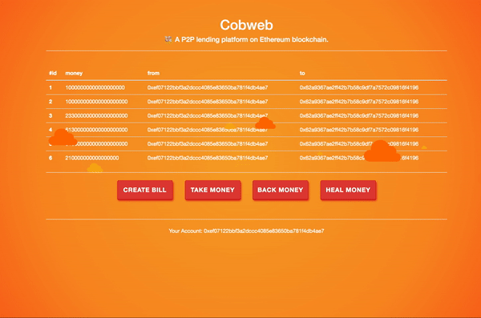

# Cobweb

💸 A P2P lending platform based on Ethereum. 

## What is Cobweb ? 

Cobweb is a P2P lending platform based on Ethereum. 

The platform is dedicated to solving the problem of asymmetric information between the two parties in the P2P lending, misappropriation of borrowings by the transaction intermediary platform, and even the borrower's overdue payment.



## Why do we need Cobweb ?

### Transparent

Everyone can check the borrowing situation of everyone, the borrower and the lender are all in the same position, and there will be no information asymmetry.

### No Middleman

Every loan is directly from the borrower to the lender, without passing through the middleman, so there will be no situation where the platform collapses and the money escapes.

### Credit system

With the blockchain, we can record the repayment situation of each individual, the borrowing situation, we can establish an open and transparent credit system based on economic principles and sociology.

## Quick Start

Before you start, you need to install the following things: 

1. [nodejs](https://nodejs.org/)

2. [truffle](https://truffleframework.com/truffle)

3. [ganache](https://truffleframework.com/ganache)

4. [metamask](https://metamask.io/)

OK, let's go.

1. down the repo.

```shell
$ git clone https://github.com/Zophyr/Cobweb
```

2. open ganache

3. migrate the contract

```shell
$ cd Cobweb/
$ truffle migrate --reset
```

4. run test

```shell
$ truffle test
```

When you see info like the following, you have successfully installed:

```shell
Using network 'development'.


  Contract: Cobweb
    ✓ Connect the blockchain and find the address. 
    ✓ Create two bills.  (347ms)
    ✓ Try to withdraw money by asker.  (184ms)
    ✓ Try to return money by asker.  (244ms)
    ✓ Try to callback money by giver.  (205ms)


  5 passing (1s)

```

## User Interface

You can run 

```shell
$ npm run dev
```

to open the website for cobweb.

When you want to connect to the blockchain, you need to add a account from **Ganache** to **metamask**.

After that, you can see your account address display on the bottom of the website.

## Room for improvement

### Mortgage transfer

We can write the lender's mortgage ownership to the blockchain. When the lender is unable to repay the debt, we automatically transfer the ownership of the mortgage to the borrower. However, the problem is that the relevant society and relevant legal institutions are required to recognize the contract.

### Credit rating

With the help of Ethereum, we give each customer a credit rating based on the user's past loan and repayment situation. According to different ratings, the amount of money the user can borrow will be different.

### Better human-computer interaction

It should be cross-platform. There shouldn't be just one web side, there should be a mobile client and a computer client or even a WeChat miniprogram. At the same time, there is still huge room for improvement in human-computer interaction.